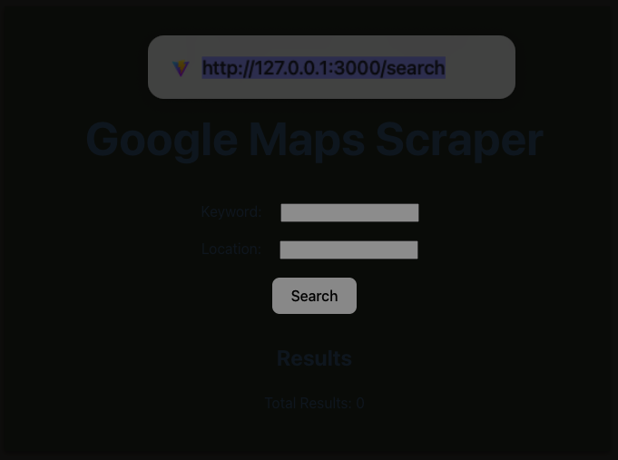

---

# inSkrap

A web application that scrapes data from Google Maps based on a given keyword and location, and displays the results. Users can export the results to PDF and Excel formats. Now with Docker support!

## Table of Contents

- [Google Maps Scraper](#google-maps-scraper)
  - [Table of Contents](#table-of-contents)
  - [Project Description](#project-description)
  - [Features](#features)
  - [Setup Instructions](#setup-instructions)
    - [Docker Setup](#docker-setup)
  - [Usage](#usage)
  - [Technologies Used](#technologies-used)

## Project Description

This project is a web application that allows users to scrape data from Google Maps based on a specified keyword and location. The application displays the results in a table and provides options to export the data to PDF and Excel formats. Now, the application can be easily set up and run using Docker.

## Features

- Search and scrape data from Google Maps based on keyword and location.
- Display results in a table format.
- Export results to PDF.
- Export results to Excel.
- Interactive neural noise background effect.
- Docker support for easy setup and deployment.

## Setup Instructions

### Docker Setup

1. **Clone the repository:**

   ```bash
   git clone https://github.com/yourusername/google-maps-scraper.git
   cd google-maps-scraper
   ```

2. **Build the Docker image:**

   ```bash
    docker build -t wire-scraper-v0.1 .
   ```

3. **Run the Docker container:**
   ```bash
    docker run -p 5000:5000 -p 3000:3000 wire-scraper-v0.1
   ```
   

## Usage

1. Open your web browser and navigate to `http://localhost:3000` to access the application.
2. Enter the keyword and location in the search form and click "Search".
3. View the results displayed in the table.
4. Use the "Export to PDF" and "Export to Excel" buttons to save the results.

## Technologies Used

- Flask
- React
- Selenium
- Webdriver-Manager
- Docker

```

```
